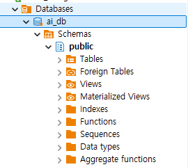

## AI-database-2026

AI 에이전트 개발자 과정 데이터베이스 리포지토리

## 1일차

### PostgreSQL

데이터베이스.데이터를 한 군데에서 관리하는 목적의 시스템

줄여서 Postgre, Postgres 라고 통칭. **관계형** 데이터베이스.

`SQL`을 통해서 데이터를 저장, 수정, 삭제, 조회 할 수 있는 시스템

- 기타 관계형 데이터베이스
- Oracle
- MySQL / MariaDB
- SQL Server

위 대부분 상용 소프트웨어, Postgre는 **오픈소스 시스템** 라이선스 비용X

### DB의 특징

- 데이터 무결성
- 데이터 안정성
- 데이터 동시성
- 표준 SQL 지원
- 확장성

### PostgreSQL설치

### 기본 설치

- 자신의 OS에 직접 설치하는 방법
  postgresql-18.6-3windowS-x64.exe

superuser 아이디- postgres 패스워드 지정
port 5432 기억할 것
정상

#### Docker 개요

- 환경의존성 문제를 해결한 컨테이너 기술 솔루션
- 가상환경 상 프로그램 실행하게 제공
- 컨테이너 -OS, 라이브러리, 설정 등이 하나의 패키지로  만들어진 이미지
- 기본 Docker 실행파일 -> Docker Desktop 윈도우에서 Docker를 편하게 사용하도록

### Docker Desktop 설치

- https://www.docker.com/products/docker-desktop/
- 윈도우 버전 다운로드 후 설치
- close and Restart 이후
- WSL (window Subsystem for Linux) 추가 설치

### DBeaver설치

GUI DB 관리 툴
https://dbeaver.io/download/
설치생략

### DB접속

1. DBeaver 실행
2. 새 데이터베이스 연결


- 이미지: 도커 리포지토리에 미리 만들어놓은 시스템 패키지
- 컨테이너: 나의 도커에서 미리 다운로드 받은 이미지를 동작시킨 시스템


도커 명령어 기본

docker --version

- 설치된 도커 확인
-

### 도커에서 PostgreSQL 이미지 다운로드

docker pull postgres:latest

-docker Desktop 전체 검색에서 pull(다운로드)


### 컨테이너 실행

####도커 명령어로 실행

- 여러 옵션으로 실행을 해야하므로 거의 대부분 명령어로 실행
  bash

  ```
  docker run -- name my-postgres -e POSTGRES_PASSWORD=123456 - p 25432:5432 -d postgres:latest
  ```


DBeaver에서 접속


DB 기본 사용법


Postgre SQL기본구조



ai-db 데이터 베이스 (프로젝트 전체 공간)

schemas-프로젝트 폴더

tables

DB생성

- SQL 편집기 클릭
- 새 이름으로 저장 *SQL로 저장
- ai-db 명칭의 새 데이터베이스 생성

```sql
create database ai_db;
```

- Ctrl + Enter로 쿼리 실행
- DB접속 정보에서 Show All databases를 체크하고 재접속
- 데이터베이스 생성확인

테이블 생성

- 아래의 코드 작성

  ```

  --테이블 생성
  create table students (
   	id int generated always as identity primary key, --학생 구분값 자동증가
   	name varchar(50) not null, -- 이름
   	age int, --나이
   	email varchar(100), --이메일
   	created_at timestamp default current_timestamp -- 현재 작성된 일자
  );
  ```
- ctrl+ Enter 실행
- 실행결과

### 데이터 생성

- insert 쿼리 작성
- ```

  --데이터 삽입 (INSERT)
  insert into students (name,age,email)
  values ('홍길동',20,'honggd@example.com');


  insert into students (name,age,email)
  values ('김철수', 21,'kim@gmail.com'),
         ('이영희', 21, 'lee@gmail.com'),
         ('박민수', 22, 'park@gmail.com'),
         ('성명건', 50, 'sung@gmail.com');
  ```

### select쿼리 작성- 난이도가 올라감

--데이터 확인 (SELECT)
select * from piblic.students;


-update 쿼리 작성


--데이터 수정 (UPDATE)

```
update students s set
	email = 'hong@kakako.com'
where id =7;
```


--데이터 삭제 (DELETE)

```
delete from students
  where name = '홍길동';
```


- CUD- Creat,Update, Delete 의 약자
- C- INSERT
- U- UPDATE
- D- DELETE

Postgres 기본타입


| 데이터타입 | 설명                          | 예제                 |
| ---------- | ----------------------------- | :------------------- |
| INT        | 정수                          | 19,25,-9             |
| BIGINT     | 큰정수                        | 19999999999          |
| NUMERIC    | 정확한 소수                   | 1200000.56           |
| VARCHAR(n) | 길이제한 문자열 (4000자 이하) | '홍길동'             |
| TEXT       | 긴문자열 (대략 26)            | 뉴스 게시물 본문     |
| BOOLEAN    | 참 또는 거짓                  | true, false          |
| DATE       | 날짜                          | 21026-09-15          |
| TIMESTAMP  | 일자 (날짜와 시간)            | 2026-09-15 16:20.456 |
| JSONB      | JSON 데이터                   | {"NAME":"홍길동"}    |
